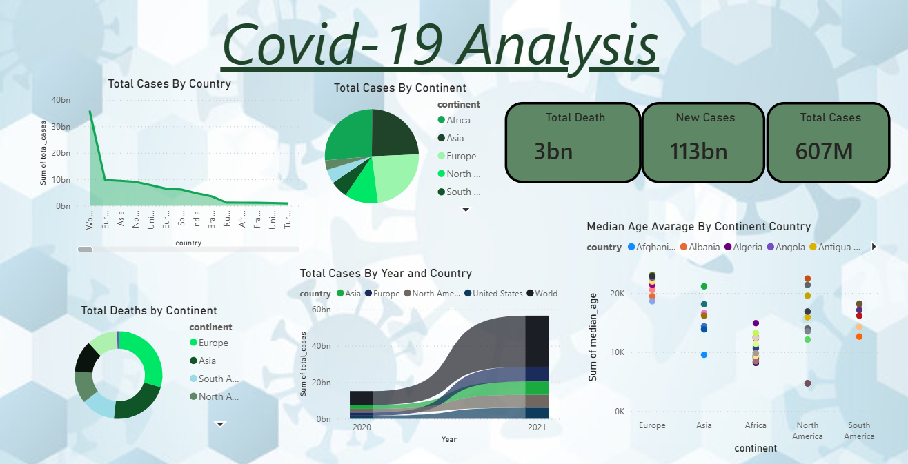

# COVID-19 Analysis Dashboard (Power BI)

An interactive Power BI dashboard analyzing global COVID-19 trends — cases, deaths, and demographic factors — using the [Our World in Data (OWID)](https://ourworldindata.org/covid-deaths) COVID-19 dataset.

## 📊 Overview

This dashboard provides a global view of the pandemic's spread and impact, covering:

- Total cases and deaths worldwide
- Country and continent-level comparisons
- Trends over time (2020–2021)
- Median age vs. COVID impact across continents

## 🔍 Key Metrics (KPI Cards)

| Metric | Description |
|---|---|
| **Total Cases** | Cumulative confirmed COVID-19 cases worldwide |
| **New Cases** | Sum of newly reported cases over the dataset's time period |
| **Total Deaths** | Cumulative confirmed COVID-19 deaths worldwide |

## 📈 Visualizations

1. **Total Cases by Country** — Area chart showing cumulative cases for the top affected countries
2. **Total Cases by Continent** — Pie chart breaking down global case share by continent
3. **Total Deaths by Continent** — Donut chart showing death distribution across continents
4. **Total Cases by Year and Country** — Stacked area chart tracking the progression of cases from 2020 to 2021 for major countries
5. **Median Age Average by Continent & Country** — Scatter plot exploring the relationship between population median age and COVID-19 impact across regions

## 🗂️ Data Source

- **Dataset:** [owid-covid-data.csv](https://github.com/owid/covid-19-data/blob/master/public/data/owid-covid-data.csv)
- **Provider:** Our World in Data
- **Fields used:** `location`, `continent`, `date`, `total_cases`, `new_cases`, `total_deaths`, `median_age`, `population`

## 🛠️ Tools Used

- **Power BI Desktop** — data modeling, DAX measures, and visualization
- **Power Query** — data cleaning and transformation
- **DAX** — calculated measures (e.g., latest cumulative totals using `LASTDATE`)

## ⚙️ How It Was Built

1. Imported the OWID COVID-19 dataset (Excel/CSV) into Power BI
2. Cleaned the data in Power Query (fixed date types, filtered aggregate rows)
3. Created DAX measures to correctly handle cumulative fields (`total_cases`, `total_deaths`) using `LASTDATE`, avoiding inflated sums
4. Built KPI cards, charts, and a scatter plot to visualize global and regional trends
5. Designed a clean dashboard layout with continent/country legends and slicers for interactivity

## 📌 Key Insights

- A small number of countries (US, India, Brazil) account for the largest share of global cases
- Europe and Asia recorded the highest cumulative case and death counts among continents
- Case growth shows distinct "wave" patterns between 2020 and 2021
- No strong universal correlation between median age and case/death counts — it varies significantly by continent

## ⚠️ Limitations

- Reporting standards and testing rates vary by country, affecting case count accuracy
- Dataset covers up to mid-2021 — does not include later pandemic waves or full vaccination rollout effects
- Some countries have incomplete or missing data for certain date ranges

## 📷 Dashboard Preview

See the screenshot at the top of this README for the full dashboard layout.

---

*Built as part of a data analytics portfolio project to practice Power BI, DAX, and data visualization with real-world public health data.*